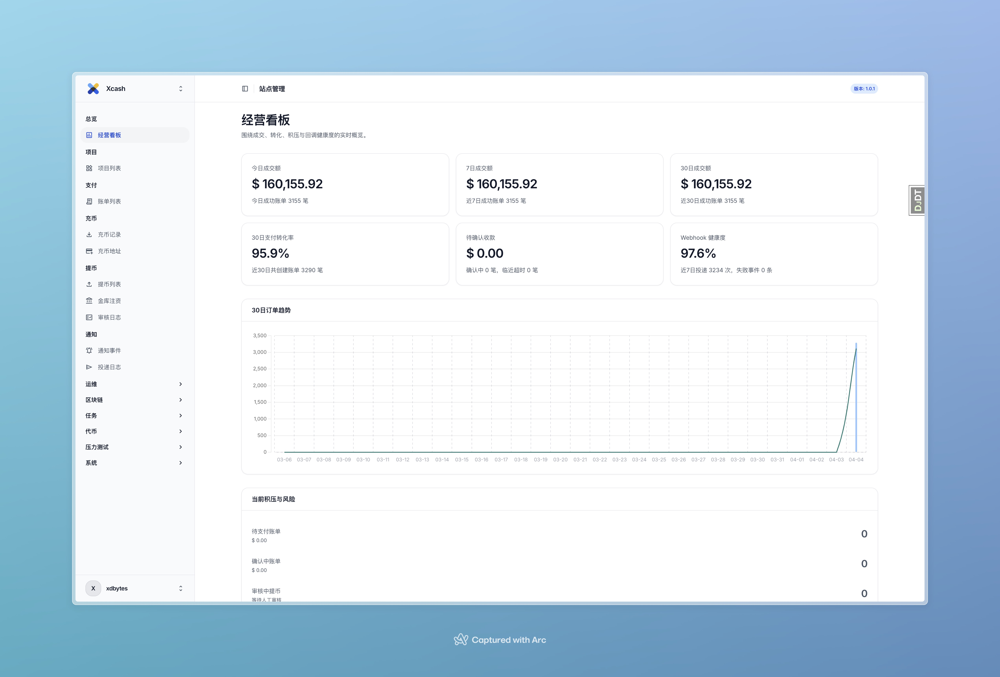
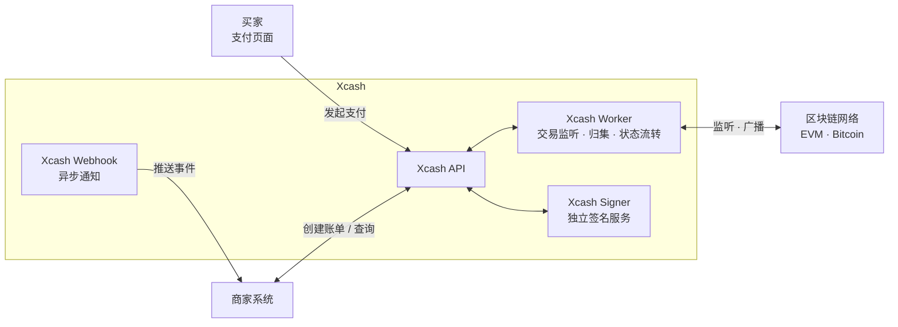

# Xcash

开源加密货币支付网关 —— 专注链上价值流通

[](LICENSE)
[](https://www.python.org/)
[](https://www.djangoproject.com/)
[](https://www.postgresql.org/)
[](https://redis.io/)
[](https://react.dev/)

Xcash 是一个面向商家的加密货币收付款基础设施。支持 EVM 兼容链和 Bitcoin，
提供 Invoice 支付、充值、提币、自动归集等完整的支付网关能力。
完全自托管，私钥永远不离开你的服务器。

## 截图



## 特性

- 🔗 **多链支持** — 支持所有 EVM 兼容链（Ethereum、BSC、Polygon 等）和 Bitcoin，更多链即将到来
- 🔐 **完全自托管** — 基于 BIP44 HD 钱包派生地址，私钥由你自己掌控，不依赖任何第三方托管
- 🚀 **一键部署** — 提供环境初始化脚本和 Docker Compose，几条命令即可启动完整服务
- 💰 **完整支付网关** — Invoice 收款、充值、提币、自动归集、Webhook 通知，覆盖加密货币收付款全链路
- 📊 **强大的管理后台** — 内置经营看板、多维度数据统计、交易趋势分析，开箱即用的运营管理能力，让你对业务全局一目了然

## 云服务

如果你不想自己部署和维护，可以直接使用官方托管版本：

👉 **[xca.sh](https://xca.sh)** — 开箱即用，免部署，持续更新

## 架构



## 快速开始

### 环境要求

- Docker 和 Docker Compose

### 1. 克隆项目

```bash
git clone https://github.com/your-org/xcash.git
cd xcash
```

### 2. 初始化环境

```bash
./scripts/init_env.sh
```

自动生成 `.env` 文件并填充所有必需的密钥（Django Secret、数据库密码、Signer 密钥等）。

如需对外提供服务，编辑 `.env` 将 `SITE_DOMAIN` 改为你的实际域名：

```env
SITE_DOMAIN=pay.example.com
```

### 3. 启动服务

```bash
docker compose up -d
```

首次启动时，如果数据库内还没有任何管理员账号，系统会自动创建默认后台账号：

```text
username: admin
password: Admin@123456
```

首次登录后台后，系统会继续引导你绑定 OTP；完成登录后请立即修改默认密码。

服务启动后访问 `http://localhost:8000` 即可使用。

## 项目结构

| 模块 | 说明 |
|------|------|
| `chains` | 链、钱包、账户、链上转账管理 |
| `currencies` | 加密货币、法币定义与汇率 |
| `invoices` | 商家收款账单 |
| `deposits` | 充值管理 |
| `withdrawals` | 提币管理 |
| `webhooks` | 异步事件通知推送 |
| `projects` | 商家项目管理 |
| `users` | 用户与权限 |
| `signer` | 独立签名服务（隔离部署） |

## 技术栈

- **后端**：Django 5.2 + Django REST Framework
- **任务队列**：Celery + Redis
- **数据库**：PostgreSQL
- **区块链交互**：web3.py（EVM）、bit（Bitcoin）
- **钱包派生**：BIP44 HD 钱包（bip-utils）
- **前端支付页**：React 19 + Vite + Tailwind CSS
- **部署**：Docker Compose

## 路线图

- [ ] Solana 链支持
- [ ] TRON 链支持
- [ ] 完善文档站

## 商业支持

如果你在部署或使用过程中需要专业协助，欢迎联系我们获取技术支持服务。

📮 联系方式：[待填写]

## 贡献

欢迎提交 Issue 和 Pull Request。

## License

[MIT](LICENSE)
